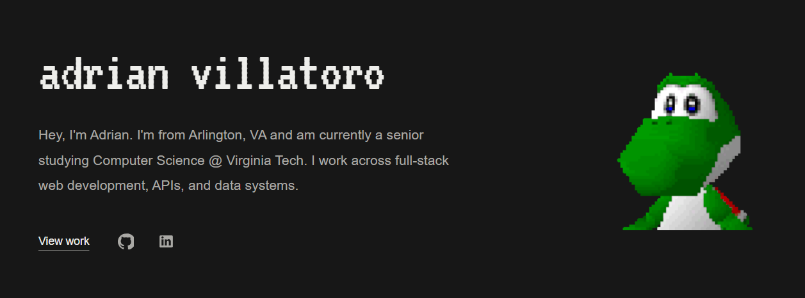

# adrian-villatoro

Live at **[adrianvillatoro.dev](https://adrianvillatoro.dev)**



My personal resume site — a single scrolling page with intro, projects, background, hobbies, and contact sections.

Built with Next.js 16, React 19, and TypeScript. Styling is plain CSS in one file.

## Run it locally

```bash
npm install
npm run dev
```

Then open http://localhost:3000.

## Where things are

| Path | What it holds |
| --- | --- |
| `src/app/page.tsx` | Every section of the page, plus the project and background data |
| `src/app/globals.css` | All styling, including the mobile layout |
| `src/app/layout.tsx` | Page title and meta description |
| `public/` | Images, GIFs, and the VT323 font |

To change the text or add a project, edit `src/app/page.tsx` — the page reloads as you save.

## Other commands

```bash
npm run build   # production build
npm run start   # serve the production build
npm run lint    # eslint
```
